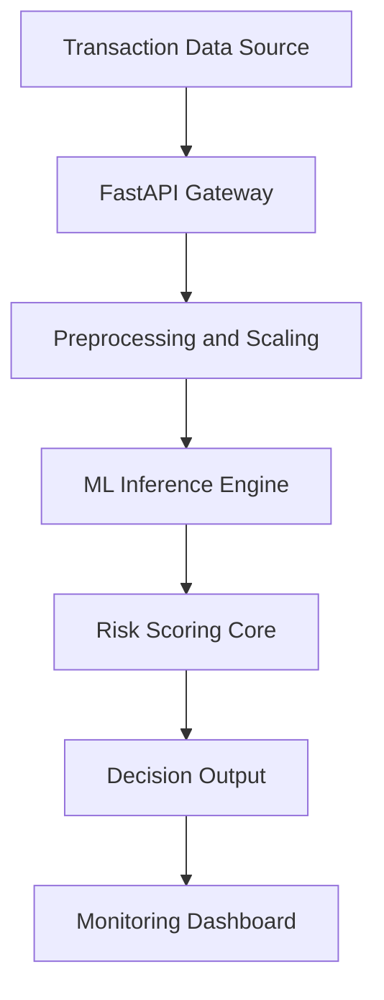

# AI-Powered Fraud Detection System

This repository contains a production-style machine learning pipeline designed to detect fraudulent financial transactions in real time. The system integrates data simulation, advanced feature engineering, multiple classification models, and a high-performance API for deployment.

## Overview

The AI-Powered Fraud Detection System addresses the critical need for automated security in fintech. By analyzing transaction metadata and behavioral patterns, the system generates real-time risk scores that enable automated decision-making.

### Key Objectives
* Implement a robust data preprocessing and feature engineering pipeline.
* Compare multiple supervised and unsupervised machine learning models.
* Handle severe class imbalance typical of financial fraud datasets.
* Provide a real-time prediction interface via a REST API.
* Visualize risk assessment through a monitoring dashboard interface.

## System Architecture

The following diagram outlines the data flow from transaction submission to risk determination:



## Machine Learning Pipeline

### Data Preprocessing
The system utilizes synthetic transaction data containing features such as transaction amount, merchant category, device type, and historical user spending. 
* **Encoding:** Categorical variables are transformed using Label Encoding.
* **Scaling:** Numerical features are standardized via StandardScaler.
* **Imbalance Management:** Synthetic Minority Over-sampling Technique (SMOTE) is applied to the training set to ensure the model effectively learns fraud signatures.

### Models Implemented
1. **XGBoost:** Primary gradient boosting model optimized for tabular data.
2. **Random Forest:** Ensemble of decision trees for robust classification.
3. **Logistic Regression:** Serves as a performance baseline.
4. **Isolation Forest:** Unsupervised anomaly detection for identifying novel fraud patterns.

### Evaluation Metrics
Given the class imbalance (typically < 5% fraud), the system is evaluated based on:
* **Recall:** Maximizing the detection of actual fraud cases.
* **Precision:** Minimizing false positives in flagged transactions.
* **F1-Score:** Balancing detection accuracy and operational friction.
* **ROC-AUC:** Assessing the probability ranking capability of the models.

## Risk Scoring and Logic

The system translates model probabilities into actionable risk levels:

| Score Range | Risk Level | Recommended Action |
|-------------|------------|--------------------|
| 0.00 - 0.30 | Low | Allow Transaction |
| 0.31 - 0.70 | Medium | Challenge (MFA/2FA) |
| 0.71 - 1.00 | High | Block Transaction |

## Project Structure

```text
fraud-detection-system/
├── data/               # Raw and processed datasets
├── models/             # Serialized model artifacts (pkl files)
├── backend/            # FastAPI application logic
├── frontend/           # Dashboard visualization (HTML/JS)
├── utils/              # Data generation and pipeline utilities
├── train.py            # Main training orchestration script
├── test_api.py         # API integration testing script
└── requirements.txt    # Project dependencies
```

## Setup and Execution

### Prerequisites
* Python 3.8 or higher
* Recommended environment: venv or conda

### Installation
1. Clone the repository.
2. Install the necessary dependencies:
   ```bash
   pip install -r requirements.txt
   ```

### Running the System
1. **Train Model:** Execute the training pipeline to generate model artifacts.
   ```bash
   python train.py
   ```
2. **Start API:** Launch the FastAPI server for real-time predictions.
   ```bash
   cd backend
   python main.py
   ```
3. **Run Tests:** Verify the API functionality using the provided test script.
   ```bash
   python test_api.py
   ```

## License

This project is licensed under the Apache License, Version 2.0. See the [LICENSE](LICENSE) file for details.

---
Copyright 2026 AI Fraud Detection System Contributors.
